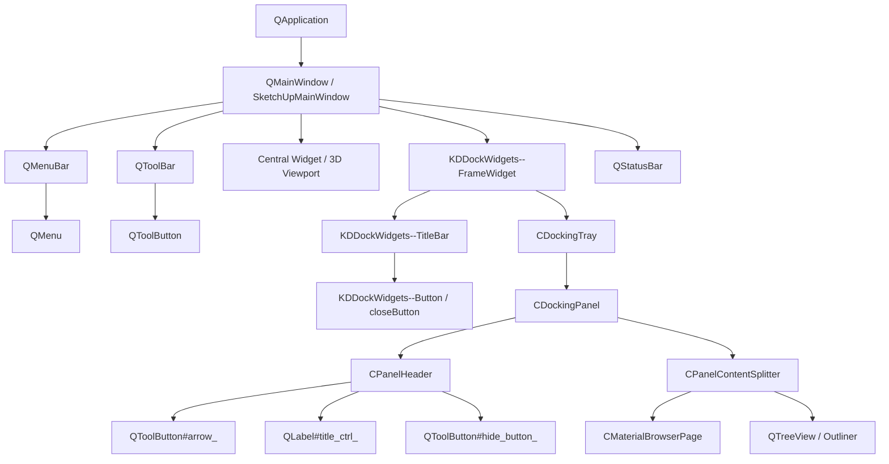

# 🎨 Complete Guide to Qt Style Sheets (QSS) in SketchUp 2024 / 2025 / 2026

Official architectural guide, selector reference, and engineering manual for customizing SketchUp's user interface with Qt Style Sheets (QSS).

---

## 📑 Table of Contents
1. [Introduction & Qt Architecture in SketchUp](#1-introduction--qt-architecture-in-sketchup)
2. [SketchUp Widget Hierarchy & Tree Map](#2-sketchup-widget-hierarchy--tree-map)
3. [Crucial Gotchas & Engineering Case Studies](#3-crucial-gotchas--engineering-case-studies)
4. [SketchUp Selector & Class Catalog](#4-sketchup-selector--class-catalog)
5. [QSS Syntax Cheat Sheet](#5-qss-syntax-cheat-sheet)
6. [How to Create & Modify Custom Themes](#6-how-to-create--modify-custom-themes)

---

## 1. Introduction & Qt Architecture in SketchUp

### 1.1. The Transition from MFC to Qt 6
For over two decades (up to version 2023), SketchUp for Windows relied on **MFC (Microsoft Foundation Classes)** and standard Win32 window handles (`HWND`).
Starting with **SketchUp 2024**, through **SketchUp 2025**, and continuing into **SketchUp 2026 (including build 26.2.243+)**, Trimble transitioned to **Qt 6 (Qt 6.5+ / 6.8+)**:
- Menus, toolbars, docking trays, status bars, and settings dialogs are now native Qt widgets.
- The docking panel system was rebuilt using **KDDockWidgets** by KDAB.
- As a result, the entire visual layout can be styled using **Qt Style Sheets (QSS)** and **QPalette**.

### 1.2. How the Qt Styling Pipeline Works
1. `QApplication::setStyleSheet(QString)` applies a global CSS cascade across the entire widget hierarchy.
2. `QApplication::setPalette(QPalette)` sets baseline system color roles (`WindowText`, `Button`, `Base`, `Highlight`, etc.) for elements not overridden by specific CSS rules.
3. `QStyleSheetStyle` intercepts widget paint events, applying box models, borders, backgrounds, and images.

---

## 2. SketchUp Widget Hierarchy & Tree Map



### Core Components:
1. **Toolbars (`QToolBar`)**: Hosts `QToolButton` elements.
2. **Docking Group Headers (`KDDockWidgets--TitleBar`)**: Header bars for docked trays.
3. **Tray Panel Headers (`CPanelHeader`)**: Section headers (Entity Info, Materials, Tags, etc.):
   - `#arrow_` — Expand/collapse chevron button.
   - `#title_ctrl_` — Panel title label.
   - `#hide_button_` — Panel close/hide button (`X`).
4. **Materials Browser (`CMaterialBrowserPage`)**: Swatch view and folder lists.

---

## 3. Crucial Gotchas & Engineering Case Studies

### ⚠️ Case Study 1: Toolbar Inflation Bug
- **Problem**: Applying borders or padding to `QToolButton` causes `QStyleSheetStyle` to override the native Windows Vista metrics. Button sizes balloon from 24×24 px to 38×38 px+, blowing out horizontal toolbars into 2–3 rows.
- **Solution**: Never style global `QToolButton` with borders or paddings. Style only the `QToolBar` container:
  ```css
  QToolBar {
      background-color: #252526;
      border: none;
      spacing: 1px;
  }
  QToolBar QToolButton:hover {
      background-color: #3e3e42;
      border-radius: 3px;
  }
  ```

### ⚠️ Case Study 2: Default Tray Min-Width Explosion
- **Problem**: Adding padding or min-width to tray containers causes the minimum width hint (`minimumSizeHint()`) of `CMaterialBrowserPage` to expand drastically (often > 320 px), locking the tray so the user cannot shrink it.
- **Solution**: Explicitly reset preview sizes:
  ```css
  CMaterialBrowserPreview,
  CMaterialBrowserPreview * {
      min-width: 0px !important;
      max-width: 100% !important;
  }
  CDockingTray QPushButton,
  CDockingTray QToolButton,
  CDockingTray QComboBox,
  CDockingTray QLineEdit {
      padding: 1px 2px !important;
      min-width: 0px !important;
  }
  ```

### ⚠️ Case Study 3: Dark Blue / Black Tooltip Text in Qt 6
- **Problem**: Setting `QToolTip { color: #ffffff; }` in QSS is ignored by Qt 6's Windows Vista style engine for `QTipLabel`, resulting in unreadable dark-blue text on dark backgrounds.
- **Solution**: Directly call `QToolTip::setPalette(const QPalette&)` via Fiddle in Ruby to override `WindowText`, `Text`, `ButtonText`, and `ToolTipText` roles with pure white `#ffffff`.

### ⚠️ Case Study 4: Hardcoded Charcoal SVG Icons & Multi-Locale Buttons
- **Problem**: SketchUp's built-in panel close icon (`dlg_tray_dialog_hide.svg`) has `fill="#252A2E"` hardcoded inside its vector XML. CSS `color:` only affects text, leaving the `X` nearly invisible on dark gray backgrounds. Furthermore, the close button in `CPanelHeader` is a `QToolButton` that may ignore pure CSS `image:` properties and does not have a static object name `#hide_button_` across different language packs.
- **Solution**: Supply a crisp vector SVG (`close_white.svg`) with `fill="#FFFFFF"`. Bind it using both `qproperty-icon:` (for genuine `QToolButton` widgets) and `image:` (for subcontrols and fallback), matching multi-lingual tooltips:
  ```css
  CPanelHeader QToolButton,
  CPanelHeader QPushButton,
  CPanelHeader QToolButton[toolTip*="Ukryj"],
  CPanelHeader QToolButton[toolTip*="Hide"],
  CDockingTray QToolButton[toolTip*="Ukryj"],
  CDockingTray QToolButton[toolTip*="Hide"],
  KDDockWidgets--Button#closeButton {
      image: url("{{ICONS_DIR}}/close_white.svg") !important;
      qproperty-icon: url("{{ICONS_DIR}}/close_white.svg");
      background-color: transparent;
      border: 1px solid transparent;
      border-radius: 3px;
      padding: 1px;
  }

  CPanelHeader QToolButton:hover,
  KDDockWidgets--Button#closeButton:hover {
      background-color: #3e3e42;
      border: 1px solid #555555;
      image: url("{{ICONS_DIR}}/close_white.svg") !important;
      qproperty-icon: url("{{ICONS_DIR}}/close_white.svg");
  }
  ```

### ⚠️ Case Study 5: Clean Rollback to Light Mode
- **Problem**: When disabling dark mode, any residual palette or stylesheet settings can leave UI components in an inconsistent hybrid state.
- **Solution**: Clear stylesheets with `setStyleSheet("")` and reapply the factory-backed `QPalette` captured at boot time, restoring 100% factory appearance.

### ⚠️ Case Study 6: Modal & Dialog Windows (White-on-White Text Fix)
- **Problem**: In `QWindowsVistaStyle`, standard dialog windows (`QDialog`, `UI.inputbox`, `QMessageBox`, `QInputDialog`, `QFileDialog`) paint their backgrounds using Windows UXTheme (`DrawThemeBackground`). When dark mode is active and the system palette sets `WindowText` to white (`#ffffff`), modal dialog backgrounds remain native light gray/white if not explicitly styled in QSS. This leads to illegible white-on-white text in `UI.inputbox` and prompt dialogs.
- **Solution**: Explicitly style `QDialog` containers with `#1e1e1e` backgrounds and ensure child `QLabel` widgets have transparent backgrounds:
  ```css
  QMainWindow,
  QDialog,
  QMessageBox,
  QInputDialog,
  QFileDialog,
  QWizard,
  QFrame#centralWidget {
      background-color: #1e1e1e;
      color: #d4d4d4;
  }

  QDialog > QWidget,
  QDialog QFrame {
      background-color: #1e1e1e;
      color: #d4d4d4;
  }

  QDialog QLabel {
      background-color: transparent;
      color: #d4d4d4;
  }
  ```

### ⚠️ Case Study 7: `qproperty-` Property Safety vs Qt Sub-controls (Crash Prevention)
- **Problem**: In Qt Style Sheets, the `qproperty-<name>` directive invokes C++ property setters on `QObject` instances declared with `Q_PROPERTY`. Attempting to apply `qproperty-icon:` to a Qt sub-control (e.g., `QDockWidget::close-button`) or via universal descendant selectors (`CDockingTray *`) causes Qt's style engine to attempt meta-object property lookup on procedurally drawn elements that do not inherit from `QObject`. This leads to an immediate fatal crash (**Access Violation 0xC0000005**).
- **Solution**: Strictly partition styling rules:
  1. **For true widgets** (`QToolButton`, `QPushButton`): Use `qproperty-icon: url(...)`.
  2. **For Qt sub-controls** (`QDockWidget::close-button`, `QScrollBar::handle`): Use standard CSS `image: url(...)` and background properties, **never** `qproperty-`.
  ```css
  /* CORRECT: Sub-controls use image: url(...) */
  QDockWidget::close-button {
      image: url("{{ICONS_DIR}}/close_white.svg") !important;
      background-color: transparent;
  }
  ```

### ⚠️ Case Study 8: Hybrid Architecture: Clean Qt 6 Palette vs Full QSS Stylesheet (`apply_qss`)
- **Comparison**:
  1. **Clean Palette (`apply_dark_palette`)**:
     - Modifies native `QPalette` roles in process memory.
     - Zero CSS parsing overhead, 0 ms latency, robust stability across any GPU driver.
     - Darkens menus, toolbars, and headers; however, some complex docking container backgrounds remain managed by Windows UXTheme.
  2. **Full QSS Stylesheet (`apply_stylesheet`)**:
     - Calls `QApplication::setStyleSheet(css)`.
     - Provides complete visual overhaul: deep dark tray backgrounds, custom borders, replaced white SVG close icons `[X]`, and dark combo dropdowns.
  3. **User Preference**:
     - The extension exposes an `apply_qss` toggle (*Qt Stylesheet*) in Settings, letting users freely choose between the rich styled experience and ultralight clean palette.

---

## 4. SketchUp Selector & Class Catalog

| Component | QSS Selector | Description |
| :--- | :--- | :--- |
| **Main Window** | `QMainWindow` | Application root background |
| **Menu Bar** | `QMenuBar` | Top menu bar background |
| **Menu Items** | `QMenuBar::item` | Top menu headers (*File*, *Edit*, *View*, etc.) |
| **Context / Dropdown Menus** | `QMenu` | Floating contextual and submenu popups |
| **Status Bar** | `QStatusBar` | Bottom hint and coordinate bar |
| **Toolbars** | `QToolBar` | Icon toolbars |
| **Dock Title Bar** | `KDDockWidgets--TitleBar` | Tray group header |
| **Dock Title Label** | `KDDockWidgets--TitleBar QLabel` | Tray group title text |
| **Dock Close Button** | `KDDockWidgets--Button#closeButton` | Close button for tray group |
| **Tray Tab Bar** | `KDDockWidgets--TabBarWidget QTabBar::tab` | Tray group tabs |
| **Panel Header** | `CPanelHeader` | Section header in tray (e.g., Entity Info) |
| **Panel Title** | `CPanelHeader #title_ctrl_` | Section title text |
| **Panel Arrow** | `CPanelHeader #arrow_` | Chevron expand/collapse button |
| **Panel Close Button** | `CPanelHeader QToolButton`, `CPanelHeader #hide_button_` | `X` close/hide button for section (multi-locale) |
| **Modal & Dialog Windows** | `QDialog`, `QMessageBox`, `QInputDialog`, `QFileDialog` | SketchUp dialogs and Ruby UI modals (`UI.inputbox`) |
| **Tray Panel Container** | `CDockingPanel` | Tray section container |
| **Materials Browser** | `CMaterialBrowserPage` | Materials panel |
| **Material Thumbnail** | `CMaterialBrowserPreview` | Active material swatch preview |
| **Outliner / Tags** | `QTreeView` | Tree views for Outliner and Tags |
| **Table Headers** | `QHeaderView::section` | Columns headers (*Name*, *Visible*) |
| **Text Fields** | `QLineEdit` | Text and coordinate inputs |
| **Spin Boxes** | `QSpinBox`, `QDoubleSpinBox` | Numeric dimension and angle inputs |
| **Combo Boxes** | `QComboBox` | Dropdown selectors |
| **Sliders** | `QSlider::groove`, `QSlider::handle` | Shadow, date, opacity sliders |
| **Scroll Bars** | `QScrollBar::handle` | Scrollbars in trays and lists |
| **Check Boxes** | `QCheckBox::indicator` | Checkboxes |
| **Tooltips** | `QToolTip` | Floating hover hints |

---

## 5. QSS Syntax Cheat Sheet

### Pseudo-states
- `:hover` — Mouse over element
- `:pressed` — Mouse button down on element
- `:checked` — Checkbox / toggle active
- `:disabled` — Inactive widget
- `:focus` — Keyboard focus

### Sub-controls
- `::drop-down` — ComboBox arrow container
- `::indicator` — Checkbox and radio square/circle
- `::handle` — Slider thumb or splitter bar
- `::close-button` — Dock widget close button

---

## 6. How to Create & Modify Custom Themes

### 6.1. Stylesheet File Location
The source stylesheet is located at:
`sketchup_dark_mode/styles/dark_theme.qss`

In an installed SketchUp environment on Windows:
`%AppData%\SketchUp\SketchUp 2025\SketchUp\Plugins\sketchup_dark_mode\styles\dark_theme.qss`
or (for SketchUp 2026):
`%AppData%\SketchUp\SketchUp 2026\SketchUp\Plugins\sketchup_dark_mode\styles\dark_theme.qss`

### 6.2. Live Hot-Reload Workflow
1. Open `sketchup_dark_mode/styles/dark_theme.qss` in your code editor.
2. Edit any color, border, or property and save (`Ctrl + S`).
3. In SketchUp, click:
   👉 **Extensions** → **Dark Mode** → **Reload CSS Stylesheet (Hot-Reload)**.
4. Changes apply instantly without restarting SketchUp or reloading models.

### Dynamic Resource Replacement (`{{ICONS_DIR}}`)
Reference icons cleanly using the placeholder:
```css
image: url("{{ICONS_DIR}}/close_white.svg");
```
The extension replaces `{{ICONS_DIR}}` with the absolute forward-slash path at runtime.
