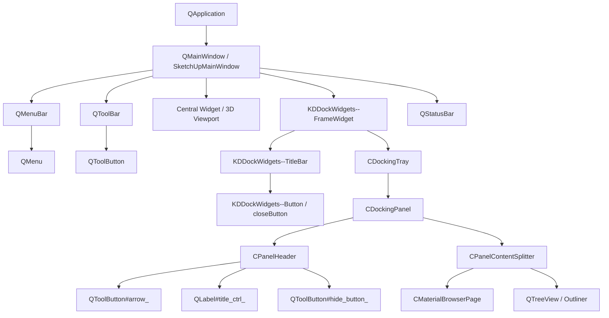

# 🎨 Kompletny Przewodnik po Qt Style Sheets (QSS) w SketchUp 2024 / 2025 / 2026

Oficjalny podręcznik architektury, reguł i zaawansowanej stylizacji interfejsu SketchUp za pomocą arkuszy stylów Qt (QSS).

---

## 📑 Spis Treści
1. [Wprowadzenie i Architektura Qt w SketchUpie](#1-wprowadzenie-i-architektura-qt-w-sketchupie)
2. [Hierarchia i Drzewo Widgetów SketchUpa](#2-hierarchia-i-drzewo-widgetów-sketchupa)
3. [Kluczowe Gotchas i Wyzwania Inżynieryjne (Studium Przypadków)](#3-kluczowe-gotchas-i-wyzwania-inżynieryjne)
4. [Katalog Selektorów i Klas dla SketchUpa](#4-katalog-selektorów-i-klas-dla-sketchupa)
5. [Ściągawka Składni QSS (Cheat Sheet)](#5-ściągawka-składni-qss-cheat-sheet)
6. [Jak Tworzyć i Modyfikować Własne Motywy (Krok po Kroku)](#6-jak-tworzyć-i-modyfikować-własne-motywy)

---

## 1. Wprowadzenie i Architektura Qt w SketchUpie

### 1.1. Przejście z MFC na Qt 6
Przez ponad 20 lat (do wersji 2023 włącznie) SketchUp na systemie Windows opierał swój interfejs o bibliotekę **MFC (Microsoft Foundation Classes)** oraz natywne kontrolki Win32 (`HWND`). 
Począwszy od wersji **SketchUp 2024**, przez **SketchUp 2025**, aż po **SketchUp 2026 (w tym build 26.2.243+)**, Trimble dokonał fundamentalnej migracji:
- Cały interfejs okienkowy (okno główne, paski narzędzi, menu, tacki boczne, okna dialogowe) został przepisany na **Qt 6 (dokładnie Qt 6.5+ / 6.8+)**.
- Do obsługi dokowania paneli bocznych i zakładek wdrożono zaawansowaną bibliotekę **KDDockWidgets** (od firmy KDAB).
- Dzięki temu niemal każdy wizualny aspekt programu może być kontrolowany za pomocą silnika **Qt Style Sheets (QSS)** oraz palety systemowej **QPalette**.

### 1.2. Jak działa silnik stylizacji Qt
Silnik `QStyleSheetStyle` w Qt działa w warstwie pośredniej pomiędzy logiką kontrolek a natywnym renderowaniem:
1. `QApplication::setStyleSheet(QString)` – aplikuje globalny arkusz reguł CSS na całe drzewo aplikacji.
2. `QApplication::setPalette(QPalette)` – ustawia bazowe role kolorów (tekst, tła, zaznaczenia) dla elementów nieobjętych jawnymi regułami CSS.
3. `QStyleSheetStyle::drawControl` / `drawPrimitive` – analizuje selektory QSS i rysuje tła, ramki oraz obrazy.

### 1.3. Różnice między CSS dla stron WWW a QSS w Qt
Choć składnia przypomina CSS 2.1, w QSS występują istotne różnice:
- **Brak zaawansowanego modelu Flexbox / Grid**: Układ w oknach Qt jest kontrolowany przez obiekty C++ (`QHBoxLayout`, `QVBoxLayout`, `QGridLayout`). QSS kontroluje jedynie wymiary, marginesy, tła i obramowania w ramach wyznaczonego prostokąta.
- **Własne pod-kontrolki**: Kontrolki złożone posiadają specjalne pseudoelementy `::` (np. `QComboBox::drop-down`, `QScrollBar::handle`, `QDockWidget::close-button`).
- **Właściwości z prefiksem `qproperty-`**: Umożliwiają bezpośrednie wywoływanie setterów C++ obiektów Qt (np. `qproperty-iconSize: 16px 16px;`).
- **Nacisk na model pudełkowy**: Każdy widget posiada `margin`, `border`, `padding` i pole zawartości `content`.

---

## 2. Hierarchia i Drzewo Widgetów SketchUpa

Główna struktura okna SketchUp 2025 składa się z następujących warstw:



### Najważniejsze komponenty:
1. **Paski narzędzi (`QToolBar`)**: Zawierają kontrolki `QToolButton`.
2. **Nagłówki dokowania (`KDDockWidgets--TitleBar`)**: Odpowiadają za górny pasek całej grupy zasobnika (z przyciskami dokowania, zwijania i zamknięcia).
3. **Nagłówki paneli zasobnika (`CPanelHeader`)**: Paski poszczególnych sekcji (np. *Informacje o elemencie*, *Materiały*, *Tagi*).
   - `#arrow_` – strzałka rozwinięcia/zwinięcia panelu.
   - `#title_ctrl_` – etykieta tekstowa tytułu sekcji.
   - `#hide_button_` – przycisk ukrycia/zamknięcia panelu (`X`).
4. **Przeglądarka materiałów (`CMaterialBrowserPage`)**: Własny widget SketchUpa z podglądem próbek i selektorami bibliotek.

---

## 3. Kluczowe Gotchas i Wyzwania Inżynieryjne

Podczas tworzenia pełnego trybu ciemnego dla SketchUp 2025 napotkano 5 krytycznych problemów środowiskowych. Poniżej znajduje się ich analiza i sprawdzone rozwiązania.

---

### ⚠️ Case Study 1: Błąd Rozpychania Pasków Narzędzi (Toolbar Inflation Bug)

#### Problem:
Gdy w arkuszu QSS zdefiniuje się globalną regułę dla przycisków narzędzi:
```css
/* BŁĄD! Psuje paski narzędzi w SketchUp */
QToolButton {
    background-color: #252526;
    border: 1px solid #3e3e42;
    padding: 3px;
}
```
Silnik `QStyleSheetStyle` zastępuje natywny styl Windows Vista (`QWindowsVistaStyle`). W rezultacie:
- Przyciski narzędzi powiększają się z domyślnych 24×24 px do ponad 38×38 px.
- Paski narzędzi przestają mieścić się na ekranie, wymuszając dwu- lub trzyrzędowe układanie i zasłaniając obszar roboczy 3D.
- Po restarcie lub przełączeniu stylów układ pasków potrafi ulec bezpowrotnemu rozjechaniu.

#### Rozwiązanie:
Nigdy nie należy stylizować globalnego selektora `QToolButton` za pomocą `border`, `padding` czy sztywnych wymiarów `min-width`. Stylizujemy wyłącznie kontener:
```css
/* PRAWIDŁOWO: Stylizujemy pasek, pozwalając ikonom zachować natywne 24x24 px */
QToolBar {
    background-color: #252526;
    border: none;
    spacing: 1px;
}
/* Ewentualne tło po najechaniu ograniczamy do specyficznych kontrolek */
QToolBar QToolButton:hover {
    background-color: #3e3e42;
    border-radius: 3px;
}
```

---

### ⚠️ Case Study 2: Rozpychanie Szerokości Zasobnika Bocznego (Min-Width Explosion)

#### Problem:
Zasobnik domyślny (*Default Tray*) w SketchUpie składa się z hierarchii: `CDockingTray` → `CDockingPanelContainer` → `CPanelContentSplitter` → `CMaterialBrowserPage`. 
Gdy do kontrolek wewnątrz zasobnika zaaplikuje się uniwersalny padding:
```css
/* BŁĄD! Blokuje minimalną szerokość zasobnika */
CDockingTray * {
    padding: 4px;
}
```
Suma `minimumSizeHint()` wszystkich dzieci w panelu materiałów rośnie lawinowo. Użytkownik traci możliwość zwężenia zasobnika (staje się on nienaturalnie szeroki i zablokowany).

#### Rozwiązanie:
1. Skasowanie minimalnej szerokości dla kontenerów podglądu materiałów:
```css
CMaterialBrowserPreview,
CMaterialBrowserPreview *,
CMaterialBrowserPreview QLabel,
CMaterialBrowserPreview QWidget {
    min-width: 0px !important;
    max-width: 100% !important;
}
```
2. Wymuszenie zerowego minimalnego marginesu na kontrolkach w zasobniku:
```css
CDockingTray QPushButton,
CDockingTray QToolButton,
CDockingTray QComboBox,
CDockingTray QLineEdit {
    padding: 1px 2px !important;
    min-width: 0px !important;
}
```

---

### ⚠️ Case Study 3: Ciemnoniebieski Tekst Dymków (QToolTip Bug w Qt 6)

#### Problem:
W SketchUp 2025 pod Windows 11 dymki podpowiedzi (tooltipy, np. *"Ukryj Informacje o elemencie"*, *"Utwórz nowy materiał"*) wyświetlały ciemnoniebieski lub czarny tekst na ciemnoszarym tle.
Próba rozwiązania w QSS:
```css
QToolTip {
    color: #ffffff !important;
    background-color: #252526 !important;
}
```
**Została zignorowana**. W Qt 6 kontrolka `QTipLabel` w stylu Windows Vista korzysta bezpośrednio z wewnętrznej palety `QToolTip::palette()`, a nie z selektora QSS `QToolTip`.

#### Rozwiązanie:
Użycie Fiddle w Ruby do bezpośredniego wywołania funkcji Qt C++:
```ruby
# Wyeksportowany symbol z Qt6Widgets.dll:
# void QToolTip::setPalette(const QPalette&)
sym = qt_widgets_handle['?setPalette@QToolTip@@SAXAEBVQPalette@@@Z']
fn_set_tooltip_palette = Fiddle::Function.new(sym, [Fiddle::TYPE_VOIDP], Fiddle::TYPE_VOID)

# Konfiguracja ról palety na czystą biel (#ffffff):
# Role 0 (WindowText), 6 (Text), 8 (ButtonText), 19 (ToolTipText)
fn_set_tooltip_palette.call(white_tooltip_palette_pointer)
```
Dzięki temu każdy dymek w programie automatycznie renderuje krystalicznie biały tekst.

---

### ⚠️ Case Study 4: Zakamuflowane Ciemne Ikony Wektorowe (Hardcoded SVG Fills)

#### Problem:
Przycisk zamknięcia panelu (`X`) w nagłówkach zasobnika (`CPanelHeader`) ma przypisaną wkompilowaną w zasoby SketchUpa ikonę:
`:/dlg_tray_dialog_hide` (plik `dlg_tray_dialog_hide.svg`).
Wewnątrz pliku SVG znajduje się kod:
```xml
<path d="..." fill="#252A2E"/>
```
Kolor `#252A2E` (niemal czarny węgiel) na ciemnym tle `#2d2d30` stawał się całkowicie niewidoczny. Właściwość CSS `color: #ffffff` nie zmienia koloru wypełnienia wewnątrz wektorowego pliku SVG. Ponadto przycisk zamykania w `CPanelHeader` to instancja `QToolButton`, która domyślnie ignoruje czystą właściwość CSS `image:`, oczekując przypisania ikony przez mechanizm Qt.

#### Rozwiązanie:
1. Przygotowanie wektora [close_white.svg](file:///D:/Projects/sketchup-dark-mode/sketchup_dark_mode/icons/close_white.svg) z zachowaniem identycznych współrzędnych i `fill="#FFFFFF"`.
2. Zastosowanie kombinacji `qproperty-icon:` oraz `image:` bezpośrednio na kontrolkach `QToolButton` z selektorami wielojęzycznymi:
```css
CPanelHeader QToolButton,
CPanelHeader QPushButton,
CPanelHeader QToolButton[toolTip*="Ukryj"],
CPanelHeader QToolButton[toolTip*="Hide"],
CDockingTray QToolButton[toolTip*="Ukryj"],
CDockingTray QToolButton[toolTip*="Hide"],
KDDockWidgets--Button#closeButton {
    image: url("{{ICONS_DIR}}/close_white.svg") !important;
    qproperty-icon: url("{{ICONS_DIR}}/close_white.svg");
    background-color: transparent;
    border: 1px solid transparent;
    border-radius: 3px;
    padding: 1px;
}

CPanelHeader QToolButton:hover,
KDDockWidgets--Button#closeButton:hover {
    background-color: #3e3e42;
    border: 1px solid #555555;
    image: url("{{ICONS_DIR}}/close_white.svg") !important;
    qproperty-icon: url("{{ICONS_DIR}}/close_white.svg");
}
```
Właściwość `qproperty-icon:` nadpisuje wbudowaną ikonę obiektu `QToolButton`, a `image:` zapewnia poprawny podgląd subkontrolek.

---

### ⚠️ Case Study 5: Bezpieczny Powrót do Jasnego Motywu (Zero-Pollution Rollback)

#### Problem:
Niektóre właściwości QSS (szczególnie `qproperty-*`) modyfikują obiekt C++ na stałe. Jeśli po wyłączeniu motywu nie przywróci się stanu początkowego, jasny motyw pozostanie uszkodzony (np. niewłaściwe ikony lub powiększone marginesy).

#### Rozwiązanie:
1. **Pełny reset arkusza stylów**:
```ruby
qapp = @fn_instance.call
# Przekazanie pustego QString ("") usuwa QStyleSheetStyle
@fn_set_stylesheet.call(qapp, empty_qstr)
```
2. **Przywrócenie zapamiętanej kopii fabrycznej `QPalette`**:
Przed zaaplikowaniem ciemnego motywu zapamiętujemy w pamięci oryginalną paletę aplikacji i dymków, a przy powrocie natychmiast ją przywracamy.
Dzięki temu program po wyłączeniu ciemnego motywu w 100% wraca do stanu fabrycznego.

---

### ⚠️ Case Study 6: Okna Modalne i Dialogowe (Biały Tekst na Białym Tle)

#### Problem:
W systemowym stylu `QWindowsVistaStyle`, standardowe okna dialogowe (`QDialog`, `UI.inputbox`, `QMessageBox`, `QInputDialog`) rysują swoje tło za pomocą mechanizmu Windows UXTheme (`DrawThemeBackground`). 
Jeśli w ciemnym motywie ustawi się jedynie paletę `QPalette` (ustawiającą `WindowText` na `#ffffff`), ale nie nada się jasnego tła w arkuszu QSS:
- Systemowe tło okna dialogowego pozostaje fabrycznie **białe/jasnoszare**.
- Kolor tekstu z ciemnej palety staje się **śnieżnobiały**.
- W efekcie etykiety stają się całkowicie nieczytelne (biały tekst na białym tle).

#### Rozwiązanie:
Jawne wymuszenie ciemnego tła kontenera w QSS na oknach dialogowych oraz ustawienie przezroczystości dla ich etykiet:
```css
/* Wymuszenie ciemnego tła dla okien i podkontenerów */
QMainWindow,
QDialog,
QMessageBox,
QInputDialog,
QFileDialog,
QWizard,
QFrame#centralWidget {
    background-color: #1e1e1e;
    color: #d4d4d4;
}

QDialog > QWidget,
QDialog QFrame {
    background-color: #1e1e1e;
    color: #d4d4d4;
}

QDialog QLabel {
    background-color: transparent;
    color: #d4d4d4;
}
```

---

### ⚠️ Case Study 7: Bezpieczeństwo właściwości `qproperty-` a Subkontrolki Qt (Crash Prevention)

#### Problem:
Właściwość `qproperty-<nazwa>` w arkuszach QSS służy do wywoływania setterów C++ w obiektach dziedziczących z `QObject` posiadających makro `Q_PROPERTY`. 
Próba przypisania `qproperty-icon:` do selektora subkontrolki (np. `QDockWidget::close-button`) lub uniwersalnego selektora potomków (`CDockingTray *`) powoduje, że silnik stylów Qt próbuje odszukać `QMetaObject` na elemencie rysowanym czysto proceduralnie przez styl. Skutkuje to natychmiastowym błędem naruszenia pamięci (**Access Violation / Crash SketchUpa**).

#### Rozwiązanie:
Ścisłe rozdzielenie reguł:
1. **Dla prawdziwych widżetów** (`QToolButton`, `QPushButton`) stosujemy `qproperty-icon: url(...)`.
2. **Dla subkontrolek Qt** (`QDockWidget::close-button`, `QDockWidget::float-button`, `QScrollBar::handle`) stosujemy wyłącznie czysty standard CSS: `image: url(...)` i tła, **nigdy** `qproperty-`.
```css
/* PRAWIDŁOWO: Subkontrolka korzysta z image: url() */
QDockWidget::close-button {
    image: url("{{ICONS_DIR}}/close_white.svg") !important;
    background-color: transparent;
}
```

---

### ⚠️ Case Study 8: Architektura Hybrydowa: Czysta Paleta Qt 6 vs Pełny Arkusz QSS (`apply_qss`)

#### Różnice:
1. **Czysta Paleta (`apply_dark_palette`)**:
   - Modyfikuje natywny obiekt `QPalette` w pamięci procesu.
   - Zero narzutu CSS, 0 ms opóźnienia, maksymalna stabilność na każdej maszynie.
   - Paski narzędzi, menu i nagłówki stają się ciemne, ale niektóre zaawansowane tła (panele docków) mogą pozostać pod kontrolą Windows UXTheme.
2. **Pełny Arkusz QSS (`apply_stylesheet`)**:
   - Przypisuje `QApplication::setStyleSheet(css)`.
   - Zapewnia głęboką, perfekcyjną stylizację: ciemne tła paneli tacki, precyzyjne zaokrąglenia, podmienione białe ikony wektorowe [X], ciemne pola list rozwijanych.
3. **Konfiguracja użytkownika**:
   - Wprowadzono opcję w ustawieniach `apply_qss` (*Arkusz stylów Qt*). Użytkownik ma pełną swobodę wyboru między pełnym motywem graficznym a ultralekką czystą paletą.

---

## 4. Katalog Selektorów i Klas dla SketchUpa

Poniższa tabela zawiera zestawienie najważniejszych elementów interfejsu SketchUpa:

| Komponent | Selektor QSS | Przeznaczenie |
| :--- | :--- | :--- |
| **Główne Okno** | `QMainWindow` | Tło okna aplikacji |
| **Pasek Menu** | `QMenuBar` | Tło górnego paska menu |
| **Element Menu** | `QMenuBar::item` | Przyciski *Plik*, *Edycja*, *Widok* itd. |
| **Menu Rozwijane** | `QMenu` | Pływające menu kontekstowe i kaskadowe |
| **Pozycja Menu** | `QMenu::item` | Pojedyncza opcja w menu |
| **Pasek Stanu** | `QStatusBar` | Dolny pasek komunikatów i podpowiedzi |
| **Paski Narzędzi** | `QToolBar` | Paski z ikonami narzędzi |
| **Przycisk Narzędzi** | `QToolBar QToolButton` | Przyciski na paskach narzędzi |
| **Nagłówek Dokowania** | `KDDockWidgets--TitleBar` | Pasek tytułowy grupy paneli KDDockWidgets |
| **Etykieta Dokowania** | `KDDockWidgets--TitleBar QLabel` | Tekst tytułu grupy dokowania |
| **Przycisk Dokowania** | `KDDockWidgets--Button` | Przyciski przypinania/zamykania doku |
| **Zakładka Dokowania** | `KDDockWidgets--TabBarWidget QTabBar::tab` | Zakładki przełączania tacek |
| **Nagłówek Panelu** | `CPanelHeader` | Pasek pojedynczego panelu (np. Informacje) |
| **Tytuł Panelu** | `CPanelHeader #title_ctrl_` | Etykieta z nazwą panelu w zasobniku |
| **Zwiń/Rozwiń Panel** | `CPanelHeader #arrow_` | Strzałka zwijania/rozwijania panelu |
| **Zamknij Panel** | `CPanelHeader QToolButton`, `CPanelHeader #hide_button_` | Przycisk `X` ukrycia danego panelu (multi-locale) |
| **Okna Dialogowe / Modalne** | `QDialog`, `QMessageBox`, `QInputDialog`, `QFileDialog` | Okna dialogowe SketchUpa i Ruby UI (`UI.inputbox`) |
| **Panel Zasobnika** | `CDockingPanel` | Kontener pojedynczego panelu w zasobniku |
| **Lista Materiałów** | `CMaterialBrowserPage` | Główny widget przeglądarki materiałów |
| **Podgląd Materiału** | `CMaterialBrowserPreview` | Miniatury i podgląd aktywnego materiału |
| **Konspekt / Tagi** | `QTreeView` | Drzewo obiektów Outlinera oraz lista Tagów |
| **Nagłówki Kolumn** | `QHeaderView::section` | Kolumny tabel i drzew (*Nazwa*, *Widoczność*) |
| **Pole Tekstowe** | `QLineEdit` | Pola wprowadzania tekstu i współrzędnych |
| **Pole Liczbowe** | `QSpinBox`, `QDoubleSpinBox` | Pola wprowadzania wymiarów, kątów itd. |
| **Lista Rozwijana** | `QComboBox` | Selektory stylów, jednostek, czcionek |
| **Suwak** | `QSlider::groove`, `QSlider::handle` | Suwaki przezroczystości, cieni, daty/godziny |
| **Pasek Przewijania** | `QScrollBar::handle` | Paski przewijania w zasobniku i oknach |
| **Przełącznik** | `QCheckBox::indicator` | Pola zaznaczenia (checkboxy) |
| **Przycisk Opcji** | `QRadioButton::indicator` | Przyciski radiowe (radiobuttons) |
| **Dymek Podpowiedzi** | `QToolTip` | Pływające dymki z tekstem pomocniczym |

---

## 5. Ściągawka Składni QSS (Cheat Sheet)

### 5.1. Model Pudełkowy (Box Model)
```css
QWidget {
    background-color: #252526; /* Kolor tła */
    color: #ffffff;            /* Kolor tekstu */
    border: 1px solid #3e3e42; /* Obramowanie */
    border-radius: 4px;        /* Zaokrąglenie rogów */
    padding: 4px 8px;          /* Wewnętrzny odstęp */
    margin: 2px;               /* Zewnętrzny margines */
    min-width: 60px;           /* Minimalna szerokość */
    min-height: 22px;          /* Minimalna wysokość */
}
```

### 5.2. Pseudo-stany (Pseudo-states)
| Pseudo-stan | Znaczenie | Przykład |
| :--- | :--- | :--- |
| `:hover` | Kursor myszy nad elementem | `QPushButton:hover { background: #3e3e42; }` |
| `:pressed` | Element wciśnięty myszą | `QPushButton:pressed { background: #0e639c; }` |
| `:checked` | Przełącznik włączony | `QCheckBox:checked { image: url(...); }` |
| `:unchecked` | Przełącznik wyłączony | `QCheckBox:unchecked { image: url(...); }` |
| `:disabled` | Kontrolka nieaktywna | `QLineEdit:disabled { color: #666666; }` |
| `:focus` | Kontrolka ma fokus klawiatury | `QLineEdit:focus { border-color: #007acc; }` |
| `:selected` | Pozycja na liście zaznaczona | `QTableView::item:selected { background: #094771; }` |

### 5.3. Pod-kontrolki (Sub-controls)
```css
/* Przycisk rozwijania listy ComboBox */
QComboBox::drop-down {
    subcontrol-origin: padding;
    subcontrol-position: top right;
    width: 18px;
    border-left: 1px solid #3e3e42;
}

/* Wskaźnik checkboxa */
QCheckBox::indicator {
    width: 14px;
    height: 14px;
    border-radius: 3px;
    border: 1px solid #555555;
    background-color: #2d2d30;
}
QCheckBox::indicator:checked {
    background-color: #007acc;
    image: url("icons/check.svg");
}

/* Uchwyt suwaka (np. Cienie) */
QSlider::handle:horizontal {
    background-color: #007acc;
    width: 12px;
    margin: -4px 0;
    border-radius: 6px;
}
```

---

## 6. Jak Tworzyć i Modyfikować Własne Motywy

### 6.1. Lokalizacja pliku stylu
Główny arkusz stylów wtyczki znajduje się w:
`sketchup_dark_mode/styles/dark_theme.qss`

W zainstalowanej wtyczce w systemie Windows:
`%AppData%\SketchUp\SketchUp 2025\SketchUp\Plugins\sketchup_dark_mode\styles\dark_theme.qss`
lub (w SketchUp 2026):
`%AppData%\SketchUp\SketchUp 2026\SketchUp\Plugins\sketchup_dark_mode\styles\dark_theme.qss`

### 6.2. Praca w trybie Hot-Reload (Bez Restartu)
Dzięki wbudowanemu mechanizmowi przeładowywania możesz edytować plik `dark_theme.qss` w swoim ulubionym edytorze kodu (VS Code, Notepad++ itd.) i natychmiast widzieć zmiany:
1. Zmień dowolny kolor lub właściwość w `dark_theme.qss` i zapisz plik (`Ctrl + S`).
2. W SketchUpie kliknij:
   👉 **Rozszerzenia** → **Tryb ciemny (Dark Mode)** → **Przeładuj styl CSS (Hot-Reload)**.
3. Interfejs zaktualizuje się w ułamku sekundy bez zamykania projektów ani modeli!

### 6.3. Podstawianie ścieżek zasobów (`{{ICONS_DIR}}`)
Jeśli w arkuszu stylów odwołujesz się do ikon:
```css
image: url("{{ICONS_DIR}}/close_white.svg");
```
Podczas ładowania silnik wtyczki automatycznie zastępuje `{{ICONS_DIR}}` pełną bezwzględną ścieżką systemową z prawidłowymi ukośnikami `/`, gwarantując stuprocentową niezawodność ładowania grafik.

---

> [!TIP]
> **Złota zasada modyfikacji stylów SketchUpa**:
> Zawsze testuj zachowanie pasków narzędzi oraz zasobnika materiałów po wprowadzeniu nowych reguł. Unikaj globalnych selektorów z `*` oraz sztywnych wartości `width` dla kontenerów nadrzędnych.
