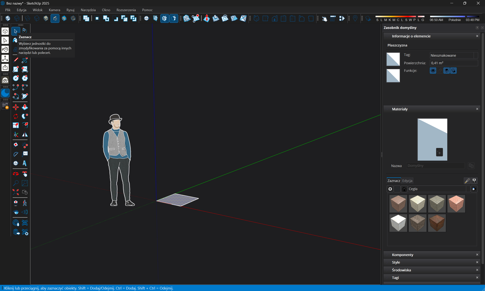

# SketchUp Dark Mode

[](https://www.sketchup.com/)
[-0078D6.svg)](https://microsoft.com/windows)
[](LICENSE)
[](https://www.ruby-lang.org/)

[**Polski opis (Polish version)**](README_PL.md)

A modern, high-performance **Dark Mode extension** for **Trimble SketchUp 2025 and 2024** on Windows 10 / 11.

It provides a complete dark theme across SketchUp's **Qt 6 user interface**, **Windows DWM title bar**, and the **3D modeling viewport**, while preserving pixel-perfect native toolbar dimensions and professional material swatch legibility.



---

## ✨ Features

- 🌙 **Qt 6 UI Dark Theme (QSS + QPalette)**:
  Dark theme applied across menus, dialogs, dockable trays (**KDDockWidgets**), Outliner, Tags, Component browser, Entity Info, and status bars.
- 📐 **Pixel-Perfect 1:1 Toolbar Scaling (No UI Inflation)**:
  Carefully engineered to prevent Qt 6's known `QStyleSheetStyle` layout bug. Tool buttons remain in native Windows Vista style metrics (24x24 px), ensuring all icons fit with zero horizontal or vertical toolbar blowout.
- 🎨 **Switchable Material List Background (Dark or Light Swatch Canvas)**:
  Choose between a fully dark materials list container and a clean white swatch canvas directly with one click from the menu (`Extensions -> Dark Mode -> Dark Materials List`) or the settings dialog.
  - Dark mode: full graphite container with dark item tiles and crisp white text.
  - Light canvas: clean white background for accurate swatch transparency and folder blending.
  - Category dropdown and panels remain dark with crisp white text in both modes.
- 🪟 **Immersive Windows 11/10 Title Bar**:
  Uses native Windows Desktop Window Manager (`DwmSetWindowAttribute`, attributes 20/19) to seamlessly darken the native OS window title bar.
- 🧊 **3D Viewport Dark Canvas**:
  Switches the modeling background to dark graphite (`#1e1e20`) and adapts edge contrasts for eye-strain-free modeling. Restores original style settings upon disabling.
- 🎛️ **Minimalist 1-Button Toolbar**:
  Single 1-click toggle button (moon/sun icon). Settings and options remain conveniently accessible from the Extensions menu.
- ⚙️ **Customizable Settings**:
  Selectively toggle UI styling, title bar styling, 3D viewport canvas styling, or enable auto-synchronization with Windows Dark/Light mode.
- ⚡ **Hot-Reload CSS**:
  Allows editing `dark_theme.qss` and instantly refreshing the theme live (`Extensions -> Dark Mode -> Reload CSS Style`).

---

## 📥 Installation

### Method 1: Ready-to-use `.rbz` (Recommended)

1. Download [`sketchup_dark_mode.rbz`](sketchup_dark_mode.rbz) from this repository (or from the Releases page).
2. Open **SketchUp 2025** (or 2024).
3. Go to top menu: **Extensions** -> **Extension Manager** (or *Rozszerzenia* -> *Menedżer rozszerzeń*).
4. Click **Install Extension** (*Zainstaluj rozszerzenie*) in the bottom left corner.
5. Select `sketchup_dark_mode.rbz`.
6. The **Dark Mode** toolbar will appear immediately! Click the moon button to activate.

### Method 2: Manual Developer Setup (Git Clone)

1. Clone or download this repository:
   ```bash
   git clone https://github.com/your-username/sketchup-dark-mode.git D:\Projects\sketchup-dark-mode
   ```
2. Create a loader file in your SketchUp Plugins folder:
   `%APPDATA%\SketchUp\SketchUp 2025\SketchUp\Plugins\sketchup_dark_mode.rb`
   With contents:
   ```ruby
   load 'D:/Projects/sketchup-dark-mode/sketchup_dark_mode.rb'
   ```
3. Restart SketchUp or run `load 'D:/Projects/sketchup-dark-mode/sketchup_dark_mode/loader.rb'` in the Ruby Console.

---

## 🛠️ How It Works (Technical Architecture)

SketchUp 2024 and 2025 transitioned their desktop UI framework from legacy MFC to **Qt 6**. This extension interfaces with the application at multiple levels:

1. **Ruby Fiddle (`qt_styler.rb`)**:
   Attaches to the active process memory using standard Ruby `Fiddle` to invoke Qt 6 exports (`QApplication::setStyle`, `QApplication::setPalette`, and `QApplication::setStyleSheet`) directly in `Qt6Widgets.dll` and `Qt6Gui.dll`.
2. **Windows Desktop Window Manager (`dwm_styler.rb`)**:
   Calls `DwmSetWindowAttribute` (`DWMWA_USE_IMMERSIVE_DARK_MODE = 20 / 19`) via `user32.dll` and `dwmapi.dll` to theme the top-level window frame and native dialogs.
3. **Ruby API Viewport Observer (`viewport_styler.rb`)**:
   Interacts with `Sketchup.active_model.rendering_options` to modify viewport background and edge colors cleanly while storing original values for lossless restoration.

## 🎨 QSS Styling Documentation & Guide

For a comprehensive deep-dive into Qt 6 styling in SketchUp 2024 / 2025, widget selectors, gotchas (toolbar inflation, tray min-width, QToolTip palette, SVG icon overrides), and custom theme creation:
- 📖 [Complete QSS Guide & Selector Reference (English)](QSS_DOCS.md)
- 📖 [Kompletny Poradnik i Ściągawka QSS (Polski)](QSS_DOCS_PL.md)

---

## 📦 Building the `.rbz` Package

To compile/package the extension into a distribution `.rbz` file:
Run the included PowerShell script:
```powershell
powershell -ExecutionPolicy Bypass -File .\build_rbz.ps1
```
This automatically produces `sketchup_dark_mode.rbz` ready for distribution.

---

## 🔍 Known Limitations & Future Roadmap

While the extension provides a complete, modern dark mode experience, certain internal SketchUp implementation specifics are documented for future research:

1. **Materials Browser Folder Thumbnails (Hardcoded White Rendered Background)**:
   - In the Materials Browser, folder category thumbnails and label boxes contain a white background that is baked/rendered directly onto the image surface by SketchUp's internal C++ drawing routine (`CMaterialBrowserPage` / `CMaterialBrowserPreview`).
   - Because this is an owner-drawn bitmap rather than a standard Qt widget background, CSS `background-color`, `color`, and `padding` rules cannot cleanly remove or reposition the white rendered surface without distorting thumbnail layout.
   - *Future exploration*: investigating low-level bitmap hook overrides or memory patches to recolor or replace the hardcoded rendered folder glyph.

2. **Tray Minimum Width after Switching from Dark to Light Mode**:
   - When switching from Dark Mode back to Light Mode during an active session, the Default Tray's minimum width (`min-width`) may remain slightly wider than SketchUp's default until the application is restarted.
   - *Cause*: Qt 6's `QStyleSheetStyle` recalculates and caches container `minimumSizeHint()` constraints on complex composite widgets (`CDockingTray`, `CPanelContentSplitter`). Even though `setStyleSheet("")` successfully unbinds the stylesheet, Qt's internal layout cache retains the evaluated minimum width until a window re-dock or application restart.
   - *Workaround*: A quick restart of SketchUp restores the exact factory minimum width.

---

## ⚠️ Disclaimer & Legal Notice

- **Independent Community Project**: This extension is an independent, community-driven open-source project developed for educational and interoperability research purposes. It is **not** created, endorsed, certified, or supported by Trimble Inc.
- **No Trademark Affiliation**: "SketchUp" and "Trimble" are registered trademarks of Trimble Inc. Their use in this repository is purely descriptive to denote software compatibility.
- **Non-Destructive**: Does not alter, crack, patch, or modify any executable files (`SketchUp.exe`) or DLLs on disk. All styles are applied dynamically in memory at runtime.
- **Warranty Disclaimer**: Provided under the MIT License "AS IS", without warranty of any kind. Users install and use this extension at their own risk.

---

## 📄 License

Distributed under the **MIT License**. See [LICENSE](LICENSE) for details.
